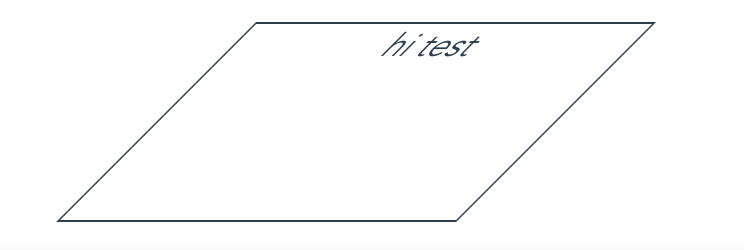
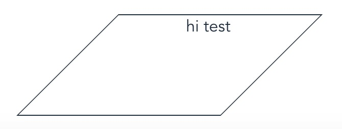

平行四边形其实就是矩形的超集，创建一个平行四边可以从矩形通过变形得到

```css
width: 200px;
height: 100px;
border: 1px solid;
margin: 0 auto;
transform: skewX(-45deg);
```


这个方法在元素旋转的同时里面的内容也倾斜了

## 嵌套元素方案
我们可以对内容在应用一次反向的`skew`变形

*html*
```html
<div class="c3-out-div">
  <div class="" style="text-align: center;">
    hi test
  </div>
</div>
```

css

```css
.c3-out-div {
  transform: skewX:(-45deg)
}
.c3-out-div div{
  transform: skewX:(45deg)
}
```


## 伪元素方案
```css
.c3-out-div {
  position: relative;
}
.c3-out-div::before{
  position: absolute;
  top: 0;
  left: 0;
  right: 0;
  bottom: 0;
  z-index: -1;
  transform: skewX(45deg)
}
```
